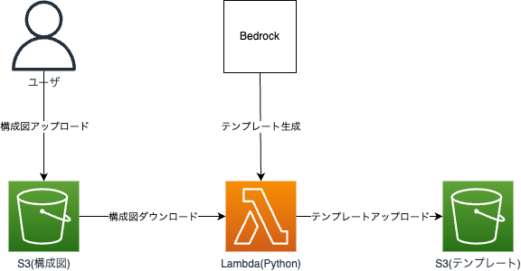

# sam-convert-diagram-to-cfn

## 概要

AWS構成図を受け取り、CloudFormationテンプレートを生成するサーバレスアプリケーションをSAMで構築します。  

## 要件

- Python 3.11
- SAM CLI

## 構成図



## デプロイ方法

1. 事前にLambdaで使用するリージョンのBedrock Claude 3を、([モデルアクセス \- Amazon Bedrock](https://docs.aws.amazon.com/ja_jp/bedrock/latest/userguide/model-access.html#model-access-add))を参考に有効化

2. 以下コマンドで、リポジトリをクローン

```bash
git clone https://github.com/tsukuboshi/sam-convert-diagram-to-cfn.git
cd sam-convert-diagram-to-cfn
```

3. 以下コマンドで、SAMアプリをビルド

``` bash
sam build
```

4. 以下コマンドで、SAMアプリをデプロイ

``` bash
sam deploy
```

※ 以下のパラメータを上書きする場合は、デプロイ時に`--parameter-overrides`オプションを使用してください。

|名前|種類|説明|デフォルト値|
|---|---|---|---|
|BedrockRegion|String|Bedrockを呼び出すリージョン|us-west-2|
|BedrockModelId|String|BedrockのモデルID|anthropic.claude-3-sonnet-20240229-v1:0|
|PromptPath|String|補足用プロンプトテキストのパス|prompt.txt|
